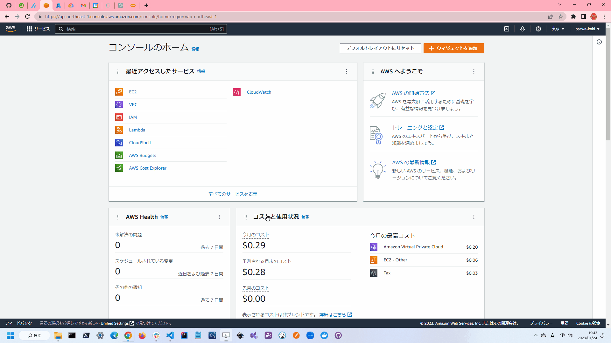

## やってみよう①

ここまででひととおりの知識は学びました。  
ということで、簡単なAWS環境構築をしてみましょう。  

目標はSSHで接続できるEC2インスタンスを作成することです。  
このためには以下のような設定が必要です。  

- VPC
- サブネット
- インターネットゲートウェイ
- ルートテーブル
- セキュリティグループ
- EC2インスタンス
- キーペア
- Elastic IP

これらの設定を、Terraformで記述していきます。  

## 完成形

いきなりですが、完成形を紹介します。  

```terraform
provider "aws" {
  region = "ap-northeast-1"
}

resource "aws_vpc" "example" {
  cidr_block = "10.0.0.0/16"
}

resource "aws_subnet" "example" {
  vpc_id = aws_vpc.example.id
  cidr_block = "10.0.1.0/24"
}

resource "aws_internet_gateway" "example" {
  vpc_id = aws_vpc.example.id
}

resource "aws_route_table" "example" {
  vpc_id = aws_vpc.example.id
  route {
    cidr_block = "0.0.0.0/0"
    gateway_id = aws_internet_gateway.example.id
  }
}

resource "aws_route_table_association" "example" {
  subnet_id      = aws_subnet.example.id
  route_table_id = aws_route_table.example.id
}

resource "aws_security_group" "example" {
  name = "example"
  vpc_id = aws_vpc.example.id
  ingress {
    from_port = 22
    to_port = 22
    protocol = "tcp"
    cidr_blocks = ["0.0.0.0/0"]
  }
  egress {
    from_port        = 0
    to_port          = 0
    protocol         = "-1"
    cidr_blocks      = ["0.0.0.0/0"]
  }
}

resource "aws_key_pair" "example" {
  key_name   = "example"
  public_key = file("~/.ssh/id_rsa.pub")
}

resource "aws_eip" "example" {
  vpc = true
}

resource "aws_instance" "example" {
  ami = "ami-be4a24d9"
  instance_type = "t2.micro"
  key_name = aws_key_pair.example.key_name
  vpc_security_group_ids = [aws_security_group.example.id]
  subnet_id = aws_subnet.example.id
  associate_public_ip_address = true
  tags = {
    Name = "happy-new-year"
  }
}
```

これに関してはTerraformに関する内容よりかは、AWSの知識が必要になってきます。  

簡単に説明すると、VPCを作成し、その中にサブネットを作成します。  
そのサブネットにインターネットゲートウェイを紐付け、ルートテーブルを作成します。  
EC2インスタンスをVPC内に作成し、セキュリティグループを設定します。  

セキュリティグループは、インバウンドとアウトバウンドの設定が必要です。  
ここでは、インバウンドはSSHのみ許可し、アウトバウンドは全て許可しています。  

また、Elastic IPを作成し、EC2インスタンスに紐付けています。  
これによって、EC2インスタンスに対して固定IPを設定することができます。  

また、EC2インスタンスにSSHで接続するためには、キーペアが必要です。  
ここでは、`~/.ssh/id_rsa.pub`を指定しています。  

これによってインターネットからSSHで接続できるEC2インスタンスが作成されます。  

---

下のGIF画像は実際に作成した様子です。  
気になる方だけ見てください。  

  
