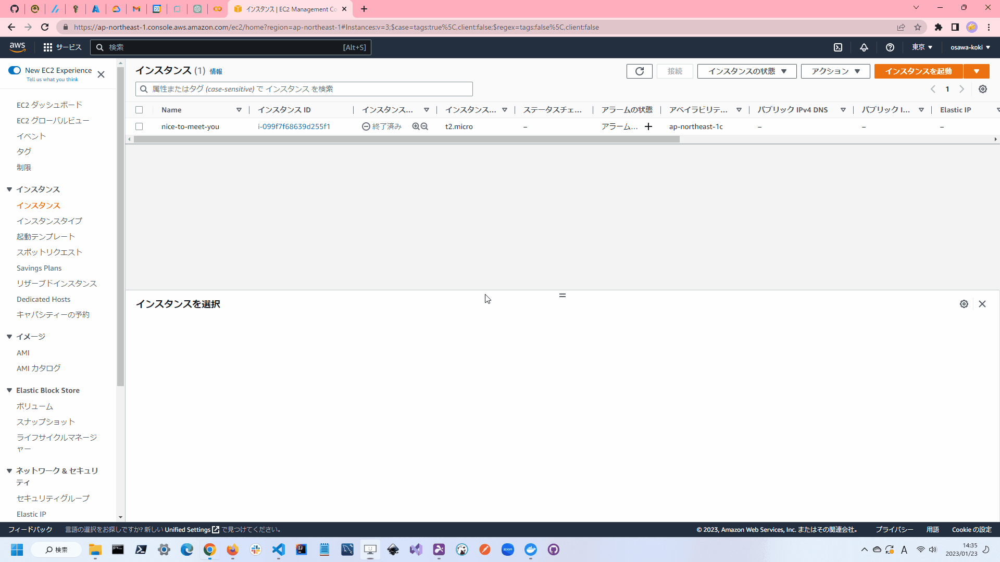

## 基本構文

Terraformでは、以下のような基本構文をとります。  

```terraform
resource "リソースタイプ" "リソース名" {
  リソースの設定
}
```

例えば、AWSのEC2インスタンスを作成する場合は、以下のようになります。  

```terraform
resource "aws_instance" "example" {
  # リソースの設定
}
```

リソースの設定では、VMイメージやリソース名、インスタンスタイプを指定します。  
これだけだとAWSのEC2インスタンスを作成することはできません。  
より詳細に設定してみましょう。  

```terraform
resource "aws_instance" "happy-new-year" {
  ami = "ami-be4a24d9"
  instance_type = "t2.micro"
  tags = {
    Name = "happy-new-year"
  }
}
```

上の例では、以下のような設定をしています。  

| 設定 | 説明 |
| --- | --- |
| `ami` | VMイメージ |
| `instance_type` | インスタンスタイプ |
| `tags` | タグ |

ここでは、`ami`には、`ami-be4a24d9`を指定し、通常のLinuxのVMイメージを指定しています。  
また、`instance_type`には、`t2.micro`を指定し、動作確認用に軽量なインスタンスタイプを指定しています。  
最後に、`tags`には、`Name`というタグを指定し、`happy-new-year`という名前を指定しています。  

`ami`や`instance_type`のパラメタは、[AMIのドキュメント](https://docs.aws.amazon.com/ja_jp/AWSEC2/latest/UserGuide/AMIs.html)や[AWSのドキュメント(instance_type)](https://docs.aws.amazon.com/ja_jp/AWSEC2/latest/UserGuide/instance-types.html)を参照してください。  

## リソースタイプ

Terraformでは、以下のようなリソースタイプがあります。  
リソースタイプは、`resource`の後に記載します。  

| リソースタイプ | 説明 |
| --- | --- |
| `aws_instance` | AWS EC2インスタンス |
| `aws_s3_bucket` | AWS S3バケット |
| `aws_s3_bucket_object` | AWS S3バケットオブジェクト |
| `aws_s3_bucket_policy` | AWS S3バケットポリシー |
| `aws_s3_bucket_public_access_block` | AWS S3バケットパブリックアクセスブロック |
| `aws_s3_bucket_notification` | AWS S3バケット通知 |
| `aws_s3_bucket_metric` | AWS S3バケットメトリクス |
| `aws_s3_bucket_inventory` | AWS S3バケットインベントリ |
| `aws_s3_bucket_analytics_configuration` | AWS S3バケットアナリティクス設定 |
| `aws_s3_bucket_ownership_controls` | AWS S3バケット所有権制御 |
| `aws_s3_bucket_website` | AWS S3バケットウェブサイト |
| `aws_s3_bucket_object_lock_configuration` | AWS S3バケットオブジェクトロック設定 |
| `aws_s3_bucket_lifecycle_configuration` | AWS S3バケットライフサイクル設定 |
| `aws_s3_bucket_cors` | AWS S3バケットCORS |
| `aws_s3_bucket_replication` | AWS S3バケットレプリケーション |

リソースタイプの詳細は、[リソースタイプのドキュメント](https://www.terraform.io/docs/providers/aws/r/index.html)を参照してください。  

## リソース名

リソース名は、`resource`の後に記載します。  
リソース名とは、Terraformで作成するリソースの名前です。  

## リソースの設定

リソースの設定は、`resource`の後のブロック内に記載します。  

### リソースの設定の例

```terraform
resource "aws_instance" "example" {
  ami           = "ami-12345678"
  instance_type = "t2.micro"
}
```

## プロバイダー

Terraformでは、以下のようなプロバイダーがあります。  
プロバイダーは、`provider`の後に記載します。  

| プロバイダー | 説明 |
| --- | --- |
| `aws` | AWS |
| `azurerm` | Azure |
| `google` | Google Cloud Platform |
| `null` | Null |
| `random` | Random |
| `template` | Template |
| `tls` | TLS |

## プロバイダーの設定

プロバイダーの設定は、`provider`の後のブロック内に記載します。  

### プロバイダーの設定の例

```terraform
provider "aws" {
  region = "ap-northeast-1"
}
```

---

では、AWSをプロバイダとして設定し、リージョンは`ap-northeast-1`を指定してみましょう。  
名前は、`happy-new-year`とします。  

```terraform
# AWSプロバイダの設定
provider "aws" {
  region = "ap-northeast-1"
}

# EC2インスタンス
resource "aws_instance" "happy-new-year" {
  ami = "ami-be4a24d9"
  instance_type = "t2.micro"
  tags = {
    Name = "happy-new-year"
  }
}
```

これを試しに実行して、リソースの作成をしてみましょう。  

```shell
terraform init
terraform apply
```

これで、EC2インスタンスが作成されました。  

  

### トラブルシューティング

作成に失敗する場合には、以下のような原因が考えられます。  

- terraformのバージョンが古い
- AWSのアクセスキーが間違っている
- ユーザの権限が足りない
- リージョンが間違っている

#### terraformのバージョンが古い

terraformのバージョンが古い場合には、terraformのバージョンを最新にしてみてください。  

#### AWSのアクセスキーが間違っている

AWSのアクセスキーが間違っている場合には、AWSのアクセスキーを確認してください。  

#### ユーザの権限が足りない

ユーザの権限が足りない場合には、ユーザの権限を確認してください。  
AWSコンソールの左上のユーザ名をクリック、セキュリティ認証情報をクリックします。  
左のメニューから、ユーザをクリックし、対象のユーザの詳細を開きます。  
「許可 - 許可の追加」から必要な権限を追加します。  

実際にはユーザに対して権限を追加するのではなく、グループやロールに対して権限を追加し、ユーザにグループやロールを割り当てることが多いです。  
また与える権限に関しては最小限にすることが望ましいです。  

テスト用ですぐにキーを削除することを想定している場合には、`AdministratorAccess`を与えてもセキュリティリスクは低いです。  
この場合、悪用されないようにキーを削除することを忘れないようにしましょう。  
作成時にキーの有効期限を短く設定することをおすすめします。  

#### リージョンが間違っている

インスタンスの生成に成功したにもかかわらず、インスタンスが表示されない場合には、リージョンが間違っている可能性があります。  
AWSコンソールの右上のリージョンをクリックし、正しいリージョンを選択してください。  

ここでは、`ap-northeast-1`を選択しています。  
日本語名は、`東京`です。  
